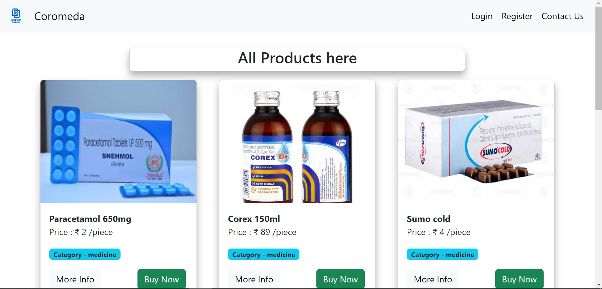
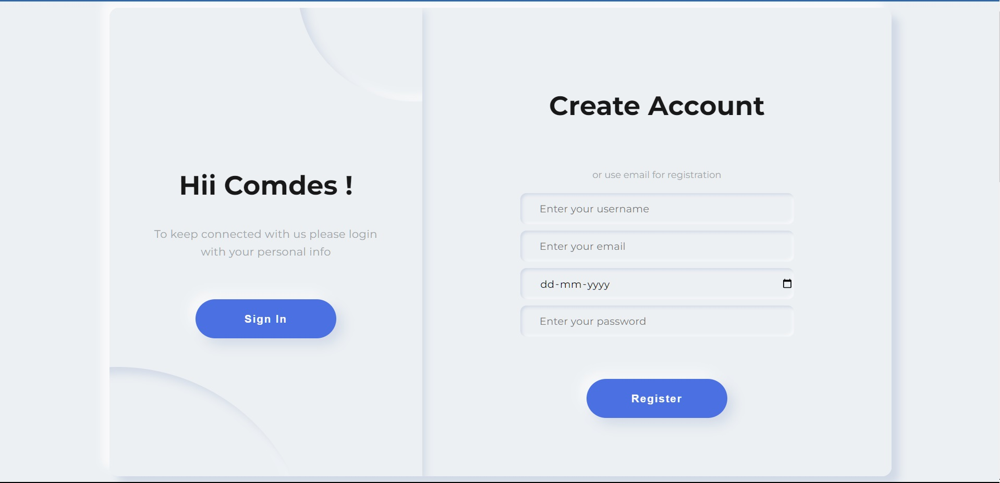
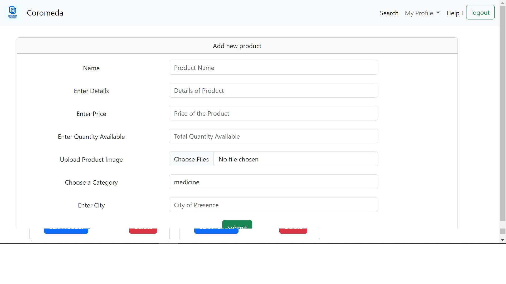
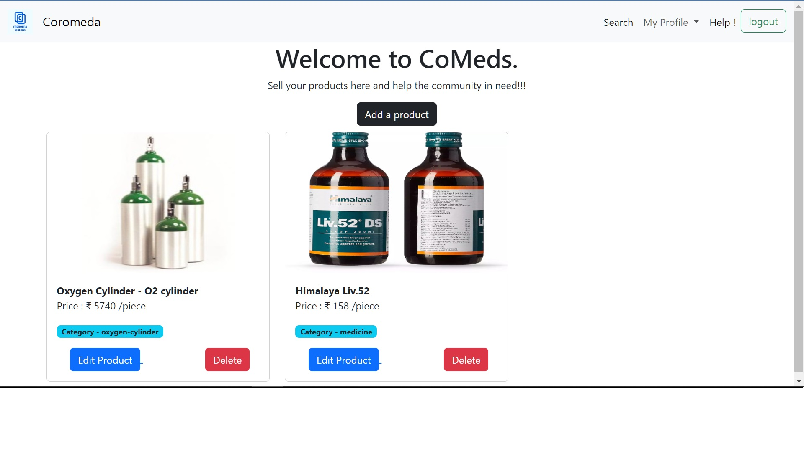

# Made by : Rahul Yadav

<h1>Coromeda - Health Equipments Website</h1>

> Website - (https://test2-production-c81c.up.railway.app/)

<h2>Table of Contents</h2>

* Homepage
* LognIn/ SignUp page
* Mobile Number Verification
* Add/ Delete/ Update Product
* Contact Us 

<h2>Coromeda - Health Equipments Website</h2>

> Coromeda is an e-Commerce Website built to provide a common platform between the medicine, oxygen-cylinders and other medical equipments suppliers and the patients in need.

<h2>Images</h2>

<h2>Description</h2>

> This is a web application which basically facilitates the users to buy medical equipment and medicines on a local scale, so that the product can delivered to them in shortest amount of time. With the help of this application, people don’t have to rush to different medical stores and clinics for important medicines. They can just order it from the website and get it delivered at their home by the delivery person. The tech stack that was used in building this project is EJS, JavaScript for templates, and CSS ,Bootstrap for styling the frontend. Talking about the backend, I have used NodeJS, Express, Mongoose with other APIs like passport for authentication , cloudinary for easily uploading media files from server-side code, twilio for the OTP verification feature. I have used MongoDB as the database.

<h2>Tech Stack used</h2>

* HTML5
* CSS3
* Javascript/ EJS
* Material Design Bootstrap
* NodeJs
* ExpressJs
* MongoDb
